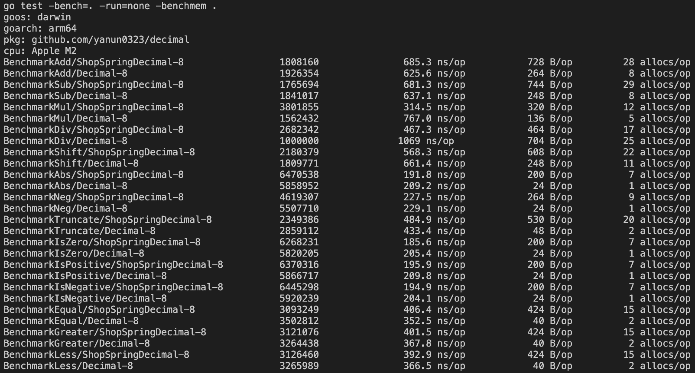

# Decimal
A high efficient decimal base on string type.

## Supported go versions
#### _GO 1.21 or higher_

## Import
```go
import "github.com/yanun0323/decimal"
```

## Features

- The zero-value is 0, and is safe to use without initialization
- Addition, subtraction with no loss of precision
- Database/sql serialization/deserialization as string
- JSON and XML serialization/deserialization as string

## Supported
- Initial from string
- Addition
- Subtraction
- Multiplication
- Negative
- Truncate
- Shift
- Compare like equal, greater, less, greater or equal, less or equal

## Unsupported Operation
- Division

## Usage
```go
// create decimal
zero := decimal.Zero()

d1, err := decimal.New("100,000.555")

d2 := decimal.Require("50_000.05")

// operation
add := d1.Add(d2).String()
println(add)            // 150000.605

sub := d1.Sub(d2).String()
println(sub)            // 50000.505

mul := d1.Mul(d2).String()
println(mul)            // 5000032750.02775

shift := d1.Shift(-2).String()
println(shift)          // 1000.00555

neg := d1.Neg().String()
println(neg)            // -150000.605

abs := neg.Abs().String()
println(abs)            // 150000.605

truncate := d1.Truncate(1).String()
println(truncate)       // 100000.5

// compare
d1.IsZero()             // false
d1.IsPositive()         // true
d1.IsNegative()         // true

d1.Equal(d2)            // false
d1.Greater(d2)          // true
d1.Less(d2)             // false
d1.GreaterOrEqual(d2)   // true
d1.LessOrEqual(d2)      // false


// method chain
result := d1.Sub(d2).Shift(-5).Add(d1).Truncate(3).String()
```

## Benchmark
Compare to [github.com/shopspring/decimal](https://github.com/shopspring/decimal)
> CPU usage almost same or less than `shopspring/decimal`
> (except multiplication)
>
> Memory usage less than half of `shopspring/decimal`


